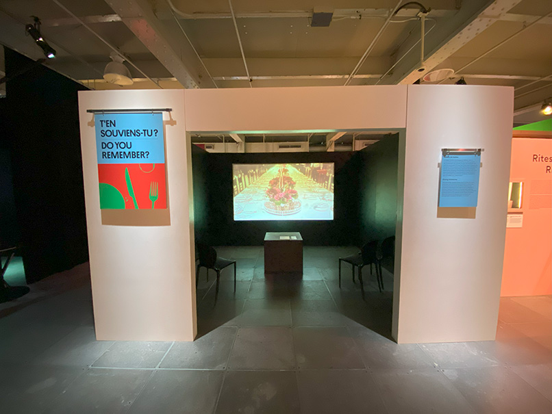
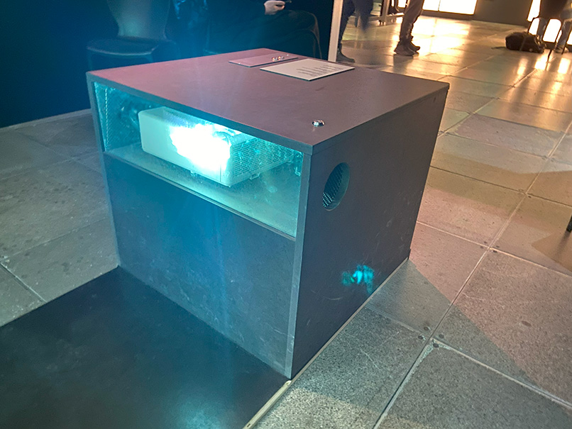
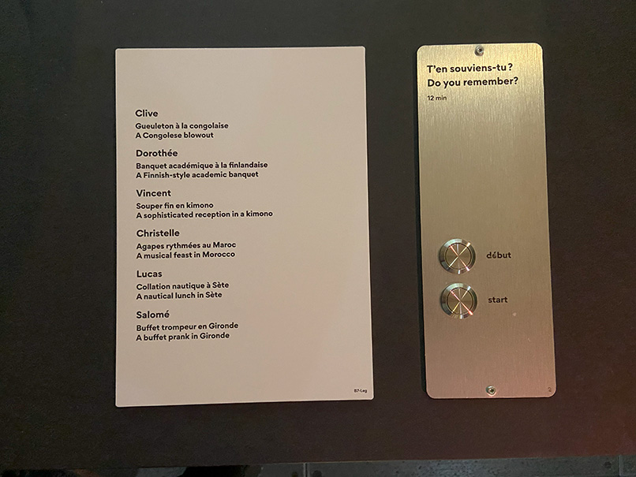

# Sortie au Centre Des Sciences de Montréal (31/01/2025)

IMG COOL DE L'EVENT

---
## Exposition : Le Banquet

IMG BANQUET
---
*Le Banquet* est une exposition scientifique basée sur la nourriture qui mélange plusieurs bornes et activités interactives pour tous âges. 

L'exposition se tient au *Centre des Sciences de Montréal*, [situé dans le Vieux-Port](https://www.montrealsciencecentre.com/visitor-info), qui est un musée qui présente des expositions basées sur la science.

*Le Banquet* offre plusieurs activités qui, au fil de l'exposition, expliquent et démontrent la science derrière la cuisine. Que se soit en montrant des vidéos informatives sur les différentes techniques de coupe, en faisant sentir à l'utlisateur différentes odeurs, ou en faisant vivre un banquet fictif, cette exposition arrive à amuser tout en informant. 

- Réalisé par : *Cité des Sciences et de l'Industrie* en partenariat avec *INRAE* et *Radio-Canada*
- Année de Réalisation : 2024
- Date personelle de visite : 31 Janvier 2025

---
## Oeuvre hoisie : T'EN SOUVIENS-TU?

---
*T'EN SOUVIENS-TU* est une projection historique dans une petite salle, un peu séparée de l'exposition. L'oeuvre présente une vidéo montrant des images de banquets historiques, expliquant comment les banquets étaient perçus au fil des années.

La salle est peinte en noir, et quelques chaises sont placées de chaque côté de l'oeuvre, avec un projecteur en son centre. Le projecteur affiche une vidéo explicative sur le mur du centre. Pour partir la vidéo, il faut appuyer sur un bouton sur la boîte qui contient le projecteur.

L'oeuvre est brève et directe. En entrant dans la salle, je me suis assis et j'ai écouté la vidéo montrée. Facile à comprendre, l'oeuvre fut très plaisante et informative.

Projecteur | Boutons
:-------------------------:|:-------------------------:
|

J'ai beaucoup aimé l'ambiance calme et tamisée lorsque l'on entre dans la pièce. J'ai pu admirer l'oeuvre sans être dérangé par le bruit ambiant autour de moi, grâce aux murs qui séparent l'ouvre du reste de l'exposition. De plus, la vidéo explicative fut vraiment intéressante. Les dispositifs installés étaient clairs et faciles à utiliser. 

Selon moi, la boîte contentant le projecteur en plein milieu de la salle aurait pu être installée au plafond ou au mur, avec un dispositif à portée de main accessible sur le mur. Le fait qu'elle soit par terre au milieu de la salle empêche plus de personnes à venir voir l'oeuvre, dû à un manque d'espace. 

IMG
---
Références : 
- 
