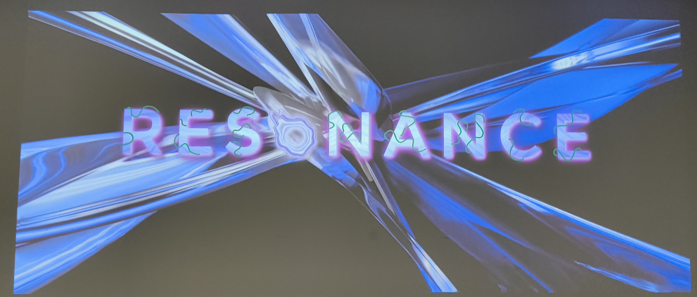
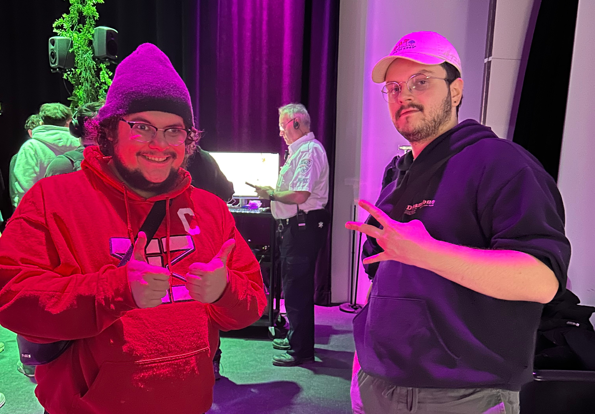
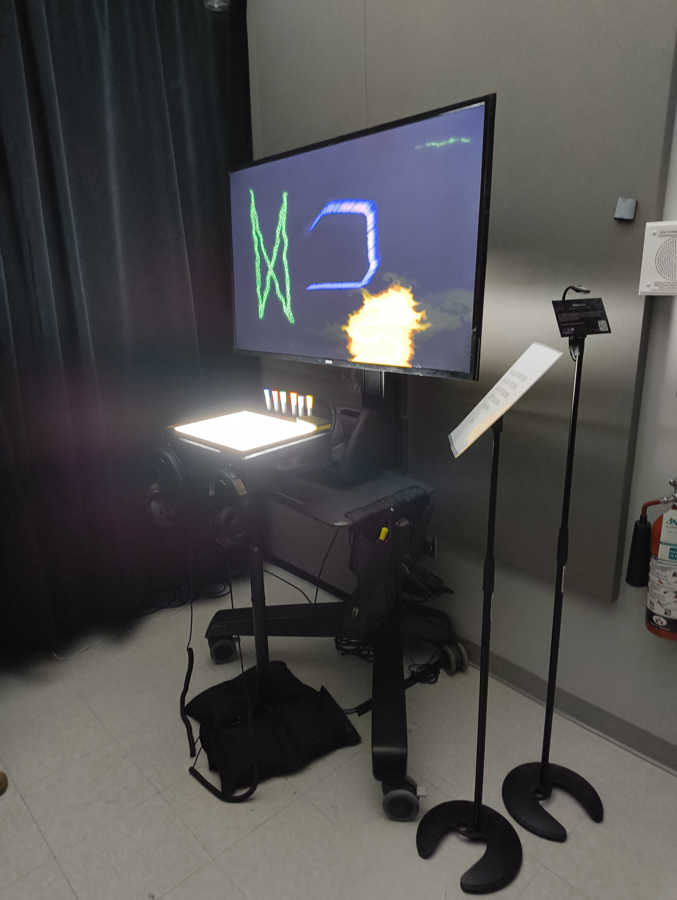
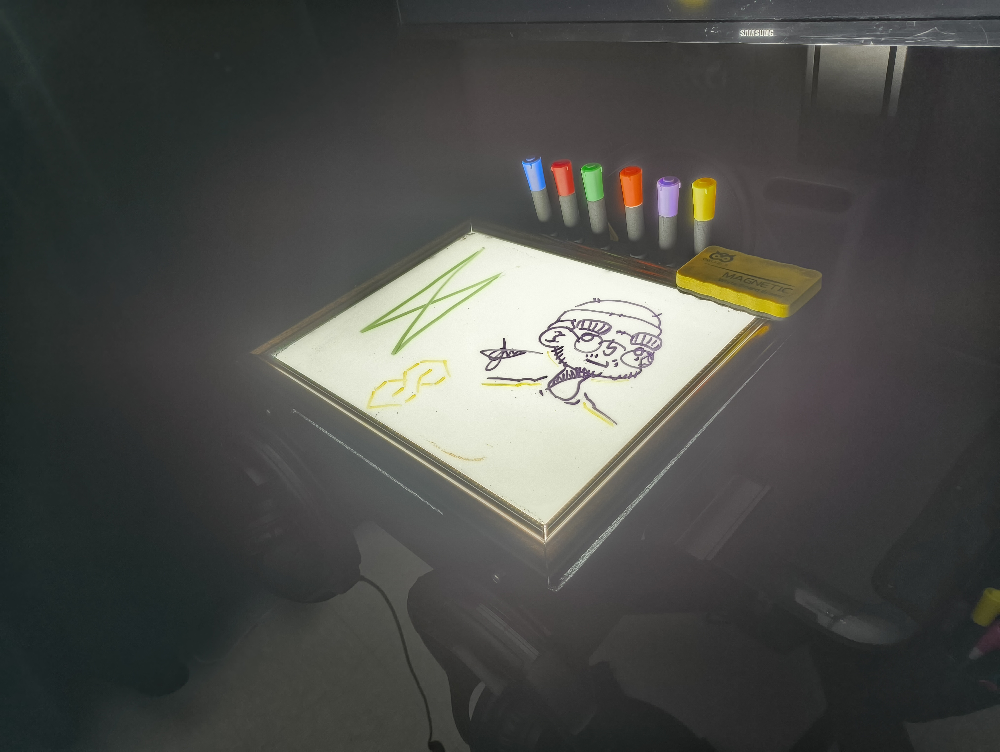
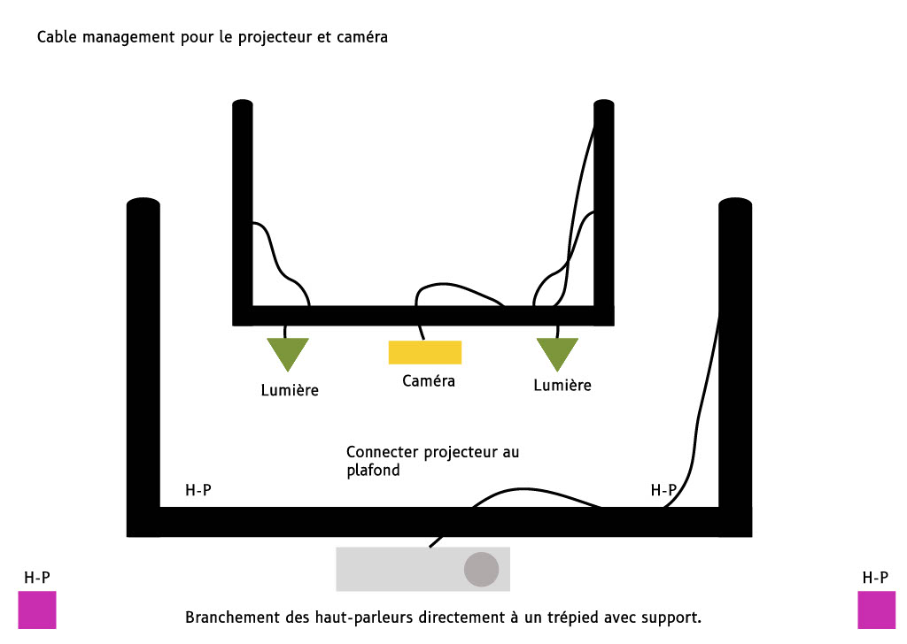
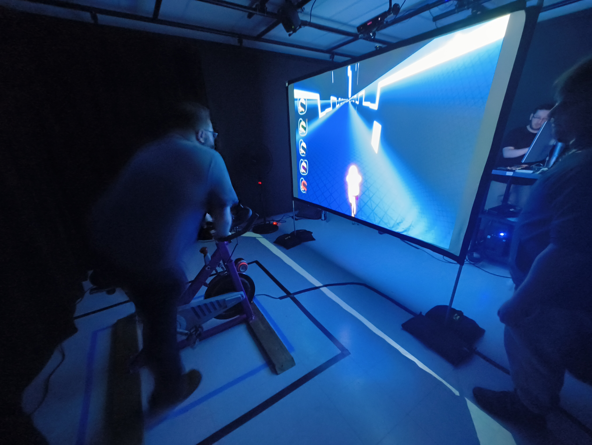

À la fin : 
- cours incontournables pour réaliser le projet (3)
- technique ou composante techno utilisée 

# EXPOSITION FINISSANTS TIM 2025 - RESONANCE

*Logo d'exposition - 18/03//2025 - prise par Olivier laliberté*

## Expositions 

- [Prismatica](#prismatica)
- [CON DU8](#condu8)
- [Luminatura](#luminatura)
- [Etheria](#etheria)
- [Fuga](#fuga)
- [Internature](#internature)
- [Arcadia](#arcadia)
---
## Informations générales 

*Ced et Oli - 25/02/2025 - prise par Efraïm Canizalez*

- Lieu d'exposition : [Cégep Montmorency](https://www.google.com/maps/place/Montmorency+College/@45.5598887,-73.7218992,16z/data=!3m2!4b1!5s0x4cc922377e2434df:0x98f825893e4ee3b0!4m6!3m5!1s0x4cc9223815890e79:0xe7408a77564697c4!8m2!3d45.5598887!4d-73.7193243!16zL20vMDdrdHJ4?entry=ttu&g_ep=EgoyMDI1MDMyMy4wIKXMDSoASAFQAw%3D%3D)
- Date de visite : 18 mars 2025
- Type d'exposition : temporaire, intérieure
---

  <h2>Prismatica</h2>

    
  <i>Vue d'ensemble - 18/03/2025 - prise par Olivier Laliberté</i>

### Installation :
- Créé par : Ikrame Rata, Vincent Delisle, Jérémy Duverseau
- Année de diffusion : 2025

    
  <i>Dessin personnel - 18/03/2025 - prise par Olivier Laliberté</i>

### Description : 
L'oeuvre est composée d'un écran de diffusion, d'un tableau blanc avec des crayons (qui nous permettent de dessiner sur le tableau), d'un capteur placé au dessus du tableau, ainsi que des écouteurs pour entendre ce que l'on dessine.

- Schéma d'installation :

 |  | 
:-------------------------:|:-------------------------:|:-------------------------:

*schémas d'installation, fournis par l'équipe de prismatica*

[GitHub_Prismatica](https://pootpookies.github.io/Prismatica/#/)

### Ressenti personnel :
Personellement, j'ai beaucoup aimé *Prismatica*.  
La présentation et l'ambiance étaient vraiment différentes des autres installations présentées, c'était beaucoup plus calme et apaisant. J'ai particulièrement aimé l'aspect artistique de l'oeuvre, puisque dessiner est une de mes passions personelles.

---

  <h2>CON DU8</h2>

    
  <i>Vue d'ensemble - 18/03/2025 - prise par Olivier Laliberté</i>

### Installation :
- Créé par : Ian Corbin, Samuel Desmeules Voyer, Alexandre Gervais, Kevin Malric, Jérémy Roy Coté
- Année de diffusion : 2025

### Description : 
L'oeuvre est munie d'un vélo stationnaire modifié avec des capteurs, un écran de diffusion avec un projecteur et des hauts-parleurs.

*img goes here*

- Schéma d'installation :

*schema goes here*

[GitHub_CONDU8](https://gearshift-games.github.io/Web-C0N-DU8/#/)

### Ressenti personnel :
CON DU8 est une oeuvre qui, à mon avis, résume parfaitement la technique d'intégration multimédia.  
Leur jeu en réalité augmentée englobe vraiment bien ce qu'on apprend dans nos cours. Le fait d'être sur un vélo dans un monde futuriste me fait beaucoup penser à TRON, je recommande fortement d'y jeter un coup d'oeil si on a aimé l'installation.

---

  <h2>Luminatura</h2>

*expo img goes here*

### Installation :
- Créé par : Audrey Dandurand, Justine Rousseau, Camila Bouatmani, Prethiah Rajaratnam, Ihab Mouhajer
- Année de diffusion : 2025

### Description : 
L'oeuvre est constituée de plusieurs lumières suspendues arborées de fleurs faites à la main, des spotlights de couleurs différentes, ainsi que des plaques tactiles supportées par des haut-parleurs.

*img goes here*

- Schéma d'installation :

*schema goes here*

[GitHub_Luminatura](https://miaou-mafia.github.io/projet-luminatura/#/)

### Ressenti personnel :
Luminatura est parti d'un concept simple, mais a été très bien exécuté.  
J'ai beaucoup aimé le côté artistique et simpliste de l'oeuvre, du fait qu'il faut juste toucher une plaque pour activer l'installation. Les visuels étaient magnifiques, j'ai particulièrement aimé le mélange de couleurs créé par l'oeuvre en tant que tel.

---

  <h2>Etheria</h2>

*expo img goes here*

### Installation :
- Créé par : Joshua Gonzalez-Barrera, Victor Gileau, Michael Un Dupré, Pierre-Luc Proulx, Maik Hamel
- Année de diffusion : 2025

### Description : 
L'oeuvre est composée d'une table blanche avec une image projetée directement dessus et des lumières en dessous, avec des pièces à jouer.

*img goes here*

- Schéma d'installation :

*schema goes here*

[GitHub_Etheria](https://ethereal-creators.github.io/Etheria/#/)

### Ressenti personnel :
Etheria était clairement mon projet préféré.  
L'idée de jouer dans plusieurs directions différentes est excellente. Le fait que cette action, pourtant très basique dans les jeux vidéos modernes, puisse être utilisée d'une autre manière originale m'a vraiment surpris et intrigué. Le visuel du jeu était vraiment bien réussi.

---

  <h2>Fuga</h2>

*expo img goes here*

### Installation :
- Créé par : Abdel Ali Djeral, Daniel Dezemma, Matis Labelle, Tristan Khadka, Yavuz-Selim Gucluer
- Année de diffusion : 2025

### Description : 
L'oeuvre est constituée de 3 écrans suspendus qui diffusent simultanément trois arbres qui grandissent et s'en vont, ainsi que 3 panneaux de contrôle différents, avec des hauts-parleurs.

- Schéma d'installation :

*schema goes here*

[GitHub_Fuga](https://escapism-fuga.github.io/Fuga/#/)

### Ressenti personnel :
Fuga a été une expérience très agréable à vivre.  
J'ai beaucoup apprécié le fait que l'on puisse contrôler chaque arbre, et que chaque station que l'on peut interagir avec soit différente des autres, comme si chaque arbre était unique. Le fait que tout les arbres sont éphemères, peu importe qui le contrôle est une belle addition auquel je ne m'attendais pas et m'a bien fait réfléchir sur la condition de l'environnement actuel. 

---

  <h2>Internature</h2>

*expo img goes here*

### Installation :
- Créé par : Kenza El Harrif, Isaac Fafard, Delphine Grenier, Khaly Tia Sing, Sitmonternna Yi
- Année de diffusion : 2025

### Description : 
L'oeuvre est constituée d'un couloir de soie, avec une boule de contrôle en son centre. Quelques hauts-parleurs sont situés autour de l'installation, aisni que des projecteurs qui projettent des images sur la toile de l'oeuvre.

- Schéma d'installation :

*schema goes here*

[GitHub_Internature](https://tprangers.github.io/internature/#/)

### Ressenti personnel :
Internature nous aspire vraiment dans un autre monde quand on passe dedans.   
Personellement, j'ai beaucoup aimé interagir avec la boule de contrôle, l'idée de pouvoir la bouger dans tout les sens était vraiment originale est très bien pensée et exécutée. Les visuels étaient organiques et fluides, ce qui m'a procuré une sensation de paix et de douceur, me rappelant une rivière et un environnement vraiment naturel.

---

  <h2>Arcadia</h2>

### Installation :
- Créé par : Anton Nikulin, Dominic Yale, William Beauvais
- Année de diffusion : 2025

### Description : 
L'oeuvre est composée d'une borne d'arcade, avec des boutons qui contrôlent un personnage, affiché sur l'écran de la borne. Des haut-parleurs étaient aussi cachés dans la borne d'arcadde.

- Schéma d'installation :

*schema goes here*

[GitHub_Arcadia](https://cousi-cousa.github.io/Arcadia/#/)

### Ressenti personnel :
Quoique très classique, Arcadia était vraiment amusant à jouer.  
L'installation me rappelait des bons souvenirs, quand j'allais jouer aux arcades étant plus petit. J'ai particulièrement aimé le look de l'arcade en tant que tel, le style de celle-ci était très réussi et m'a beaucoup attiré lorsque je l'ai vu pour la première fois. Le visuel du jeu m'a plu, puisque j'aime bien ce qui est médiéval.

---
