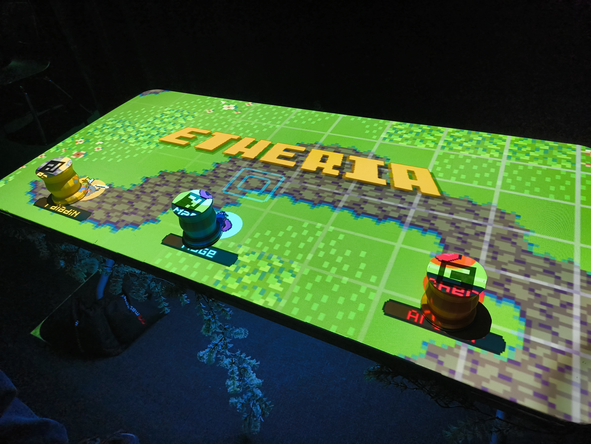
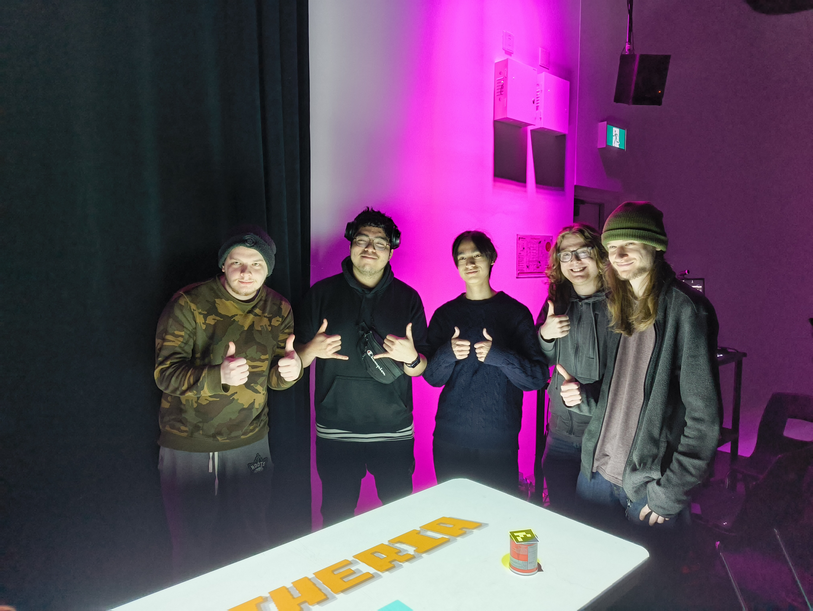
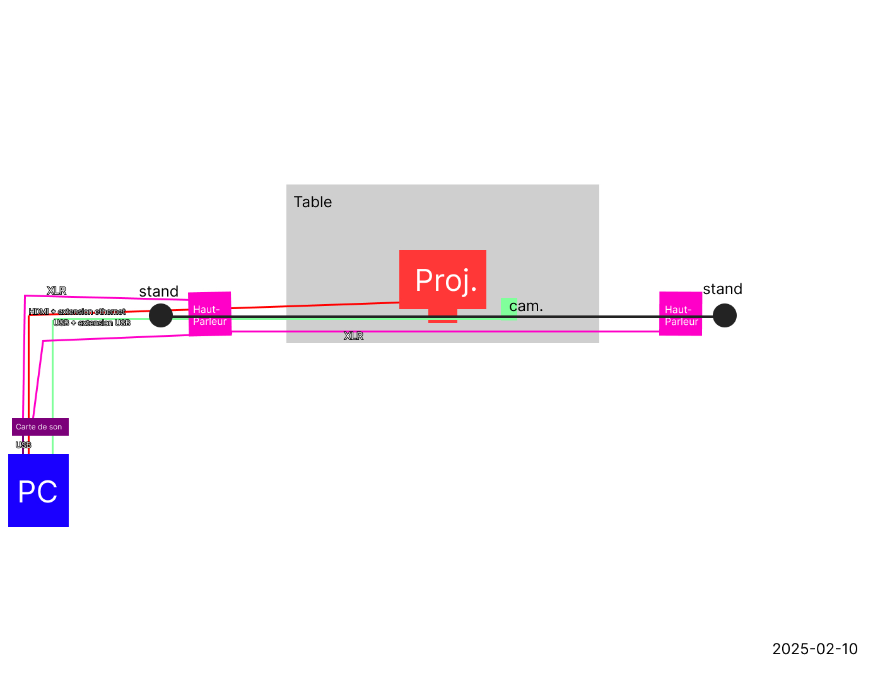
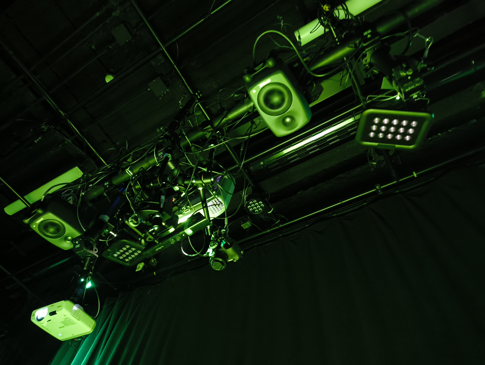
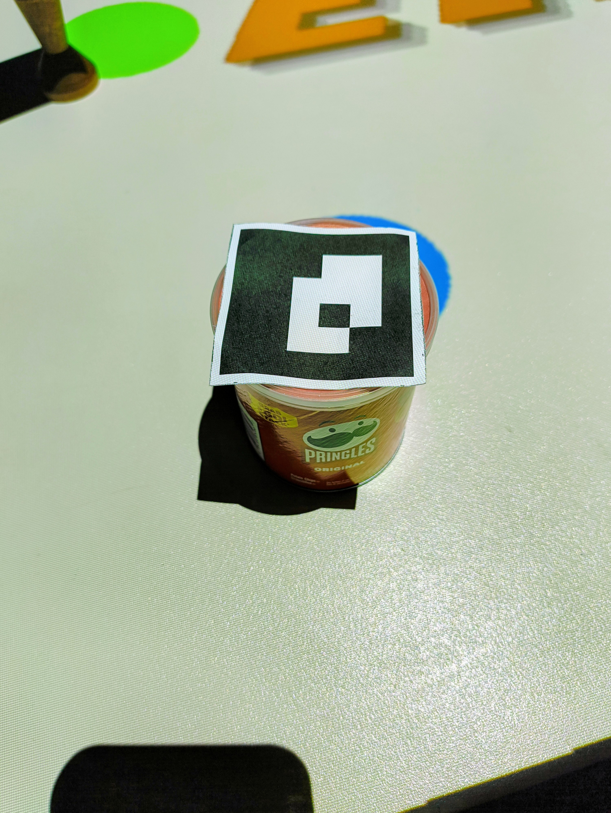
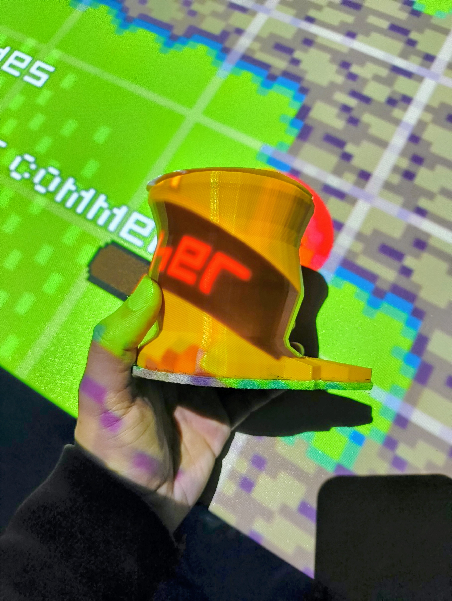

# EXPOSITION FINISSANTS TIM 2025 : Etheria

  
  <i>Vue d'ensemble - 18/03/2025 - prise par Olivier Laliberté</i>

## Fiche technique

- Lieu de mise en exposition : [Cégep Montmorency](https://www.google.com/maps/place/Montmorency+College/@45.5598887,-73.7218992,17z/data=!3m2!4b1!5s0x4cc922377e2434df:0x98f825893e4ee3b0!4m6!3m5!1s0x4cc9223815890e79:0xe7408a77564697c4!8m2!3d45.5598887!4d-73.7193243!16zL20vMDdrdHJ4?entry=ttu&g_ep=EgoyMDI1MDMyNC4wIKXMDSoASAFQAw%3D%3D)
- type d'exposition : temporaire, intérieure

## Etheria

- Créateurs : Joshua Gonzalez-Barrera, Victor Gileau, Michael Un Dupré, Pierre-Luc Proulx, Maik Hamel
- Année de réalisation : 2025

  
  <i>L'équipe des créateurs - 18/03/2025 - prise par Olivier Laliberté</i>

## Description
Etheria est un jeu de "Tower Defense" où le but du jeu est de défendre un crystal contre divers monstres et objets. Après 4 niveaux, le jeu prend fin si on a réussi à bien protéger ce crystal et un écran de victoire est montré. Durant la partie, plusieurs objets permettaient aux joueurs d'évoluer leur personnage respectif, si le joueur avec le bon personnage les ramassait. Si les joueurs n'arrivaient pas à défendre le crystal, le jeu prend fin et un écran de défaite était diffusé.

- Type d'installation : interactive
- Fonction du dispositif multimedia : scénographie

## Mise en espace

*vue d'ensemble, plantation, etc*

    
  <i>Vue d'ensemble - 18/03/2025 - prise par Olivier Laliberté</i>

    
  <i>Schéma de plantation, fourni par les créateurs de Etheria</i>

## Composantes Techniques
L'installation était composée d'une table en son centre, avec des visuels projetés sur cette table. En haut, un projecteur avec des hauts-parleurs diffusaient l'image du jeu et de la musique avec des effets de son, réagissant aux mouvements et diverses actions que les joueurs émettaient en jouant. Un capteur de mouvement était aussi utilisé pour capter les mouvements des joueurs et des pièces de jeu. En dessous de la table, des lumières et des feuilles ont été installées pour donner un aspect visuel attirant. 

    
  <i>Composantes techniques - 18/03/2025 - prise par Olivier Laliberté</i>

Au centre de l'installation : 
- Table
- Pièces de jeu personalisées

 | 
:-------------------------:|:-------------------------:

*Pièces de jeu (prototype / version finale) - 25/02/2025 / 18/03/2025 - prises par Olivier Laliberté*

Les pièces de jeu avaient toutes un code QR placé au dessus de chacune d'entre elles et une flèche pointant dans une direction quelconque. Cela permettait au capteur de détecter la rotation dans laquelle chaque pièce était, permettant de changer la direction du point de vue des personnages.

Au plafond : 
- Projecteur
- Hauts-parleurs
- Capteur de mouvement

En dessous de la table : 
- Lumières LED
- Fausses vignes
- Sacs de sable

- elements nécéssaires à la mise en expo :

## Expérience vécue 
- Date de visite : 25 février 2025, 18 mars 2025

Dès que j'ai approché la table, j'ai tout de suite compris quoi faire.  
Avec des amis, nous avons pris les pièces et commencé à jouer. Le fait que l'installation n'avait pas besoin d'explications fut un énorme point positif, et cela veut dire que l'oeuvre peut rouler sans animateur présent, ce qui desfois peut être encombrant. Les explications écrites étaient claires et concises, tout en ne ralentissant pas l'expérience de jeu.  
Le concept était simple, défendre un crystal au centre de la zone de jeu. Nous avons même réussi, à trois joueurs, à réussir du premier coup.  
Les graphismes étaient simples, en pixel art, mais vraiment mignons. J'ai particulièrement aimé le choix des couleurs, qui étaient vives et qui se mélangaient bien ensemble.

### Ce qui m'a plu :
J'ai vraiment aimé l'aspect interactif dans cette oeuvre. Le fait que l'on puisse changer le point de vue du personnage en tournant les pièces de jeu sur elles mêmes fut vraiment un aspect attirant de l'installation, j'ai trouvé cette idée vraiment originale. De plus, puisque toute la table était notre zone de jeu, nous devions nous déplacer pour pouvoir interagir d'avantage avec le jeu. Selon moi, cet aspect vient fortement renforcer l'interactivité de l'oeuvre.

### Ce que j'améliorerais :
Le jeu en soit n'était pas impossible, mais la difficulté était un peu haute lorsqu'on jouait avec seulement un ou deux joueurs. J'aurais aimé avoir des niveaux adaptés en fonction du nombre de joueurs présents autour de la table.

## Références
[GitHub Etheria](https://ethereal-creators.github.io/Etheria/#/)
