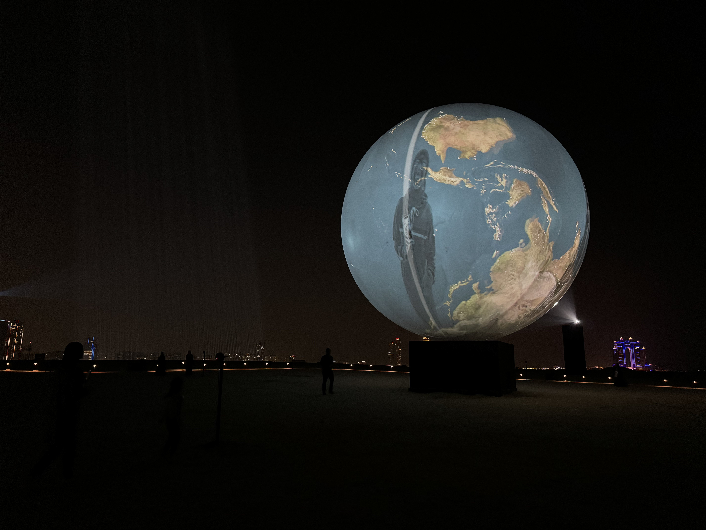

# Rafael Lozano-Hemmer: une rencontre avec Jade Seguela

## Compte rendu de la rencontre

### introduction
Le 25 mars dernier, Jade Seguela, une artiste travaillant pour l'atelier Lozano-Hemmer, nous a offert une conférence qui présentait des oeuvres multimédia très intéressantes produites par Rafael Lozano-Hemmer. Étant elle-même registraire, elle s'occupe de monter les installations de l'atelier et de trouver des acheteurs dans le monde afin de vendre ces oeuvres.

Rafael Lozano-Hemmer, artiste Canadien, est reconnu à l'international pour ses oeuvres multimédia. Mêlant l'art, l'architecture, la technologie et la performance, ses installations sont proclamées mondialement et, dans ses mots, sont des "anti-monuments pour une agence alien".

*Source : [Biographie de Rafael Lozano-Hemmer](https://www.lozano-hemmer.com/bio.php)*

### le coeur de la conférence
Durant la présentation, Jade nous a parlé de deux oeuvres en particulier : 
- [Sphere Packing : Bach](https://www.lozano-hemmer.com/sphere_packing_bach.php)
- [Shadow Tuner](https://www.lozano-hemmer.com/shadow_tuner.php)

Sphere Packing : Bach est une oeuvre physique et numérique haute de trois mètres présentant une sphère, faite d'aluminium et de bois, avec en son centre un espace pouvant accueillir des gens. Avec 1 128 haut-parleurs, cette installation joue des morceaux de Johann Sebastian Bach, un artiste classique prodige. 

   
  <i>Photo tirée du site de l'atelier Lozano-Hemmer</i>

*Source : [Sphere Packing : Bach](https://www.lozano-hemmer.com/sphere_packing_bach.php)*

Shadow Tuner est une oeuvre physique installée à Abu Dhabi présentant un globe lumineux qui projette une image de la terre renversée. L'oeuvre a des caméras posées autour d'elle, qui permettent d'afficher en forme d'ombres sur la sphère ce que les caméras voyaient. Ces mêmes ombres pouvaient atteindre jusqu'à 14 mètres.

   
  <i>Photo tirée du site de l'atelier Lozano-Hemmer</i>

*Source : [Shadow Tuner](https://www.lozano-hemmer.com/shadow_tuner.php)*

En plus de nous parler des oeuvres et de son parcours professionnel, Jade nous a partagé comment elle a rencontré Rafael. Dans la conférence, elle nous a aussi démontré certains aspects de son travail vraiment fascinants, comme le fait qu'elle connaît toutes les composantes et les emplacement des oeuvres de Rafel.

### conclusion
La conférence avec Jade Seguela nous a permis d'en apprendre plus sur un milieu artistique et technologique fascinant, créé par un artiste avec une vision du monde très hors du commun. Grâce à cela, nous avons pu voir et comprendre l'envers du décor de ses oeuvres captivantes.
