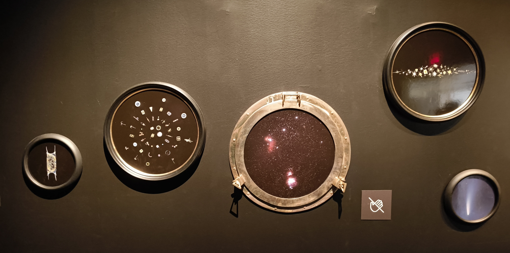
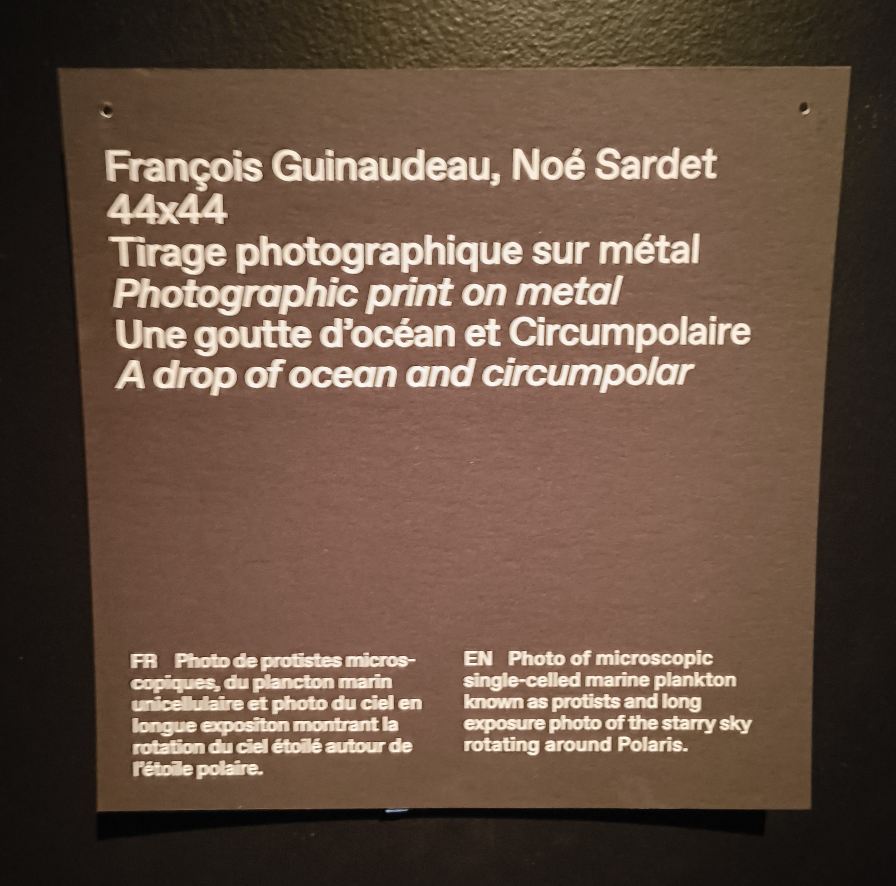
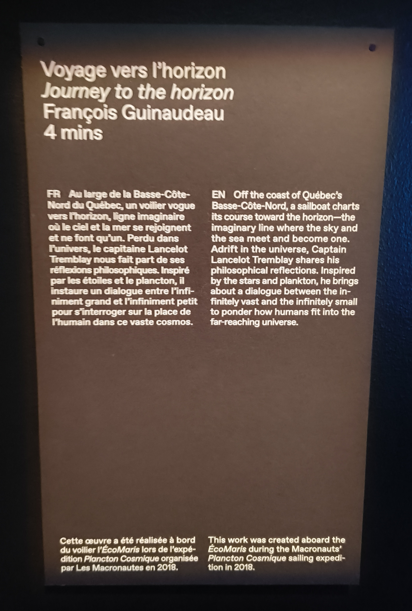
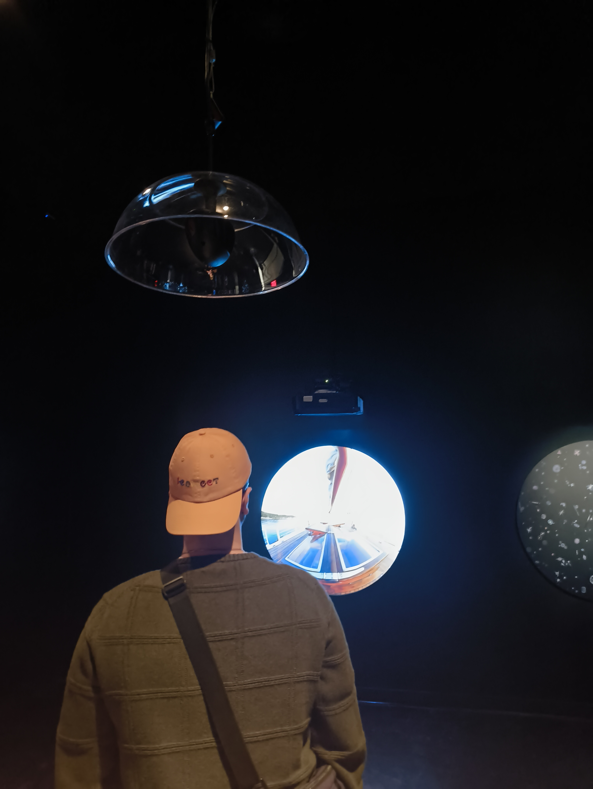
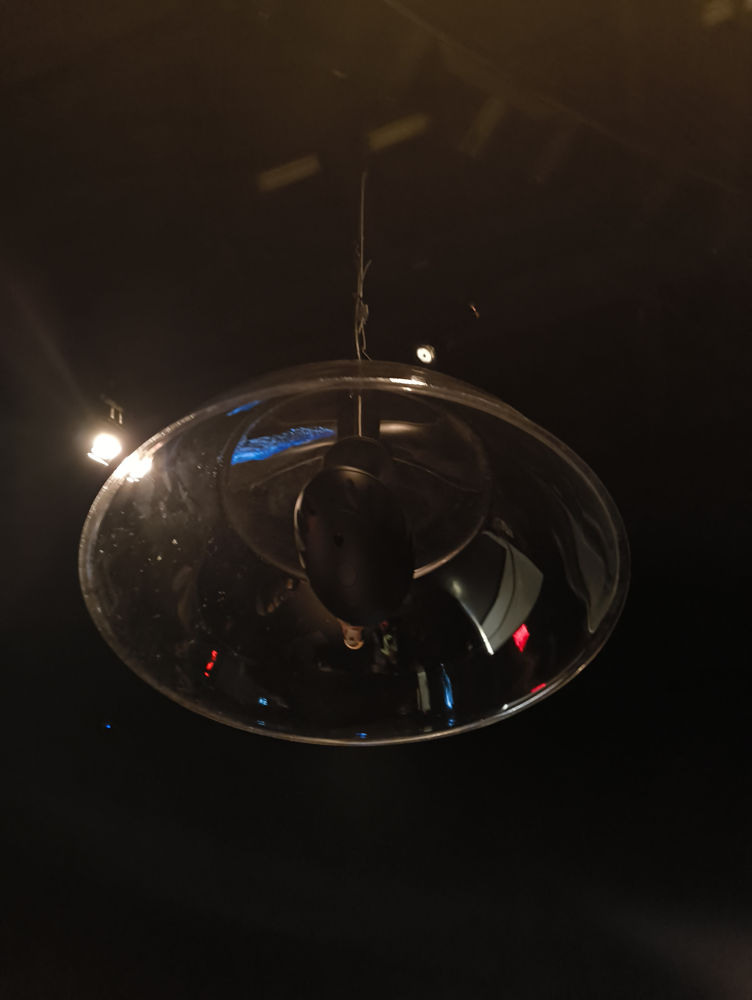
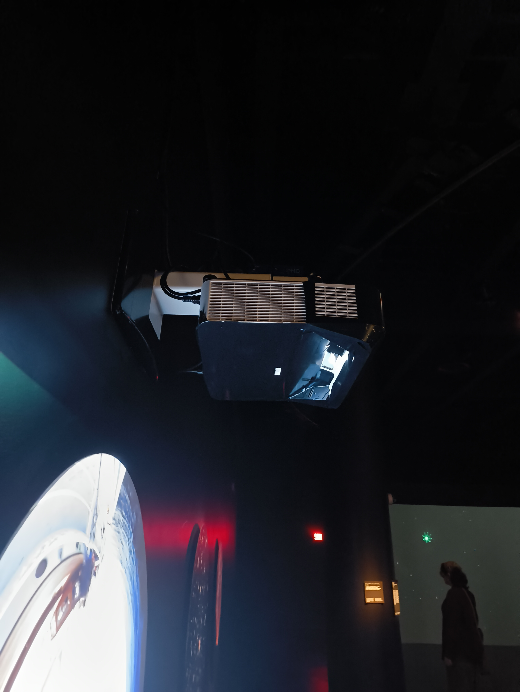

# EXPOSITION INDIVIDUELLE : PLANCTON COSMIQUE
<!--Image d'ensemble-->

   
  <i>Olivier Laliberté - Biosphère - 06/03/2025</i>

Le 6 mars dernier, j'ai eu la chance d'aller explorer la Biosphère, ce qui m'a permis d'aller voir l'exposition Plancton Cosmique. 

## L'exposition
Plancton Cosmique est une exposition centrée autour de l'infiniment petit et l'infiniment grand, et qui représente ses points en comparant les étoiles et les galaxies à des planctons. 

L'oeuvre est exposée à la [Biosphère](https://espacepourlavie.ca/en/biosphere), située à Montréal. Elle s'étend sur un étage et est sombre, seulement éclairée par des écrans et des lumières tamisées. 

Avant d'entrer dans la salle d'exposition, de grandes bannières ornent la salle d'entrée. Sur ces bannières, les références et les noms des artistes ayant travaillé sur les oeuvres y sont indiqué.

<!--Image des bannières + présence-->
 | 
:-------------------------:|:-------------------------:

*Olivier Laliberté - Bannières et Moi - 06/03/2025*

### La salle
Quand on entre dans la salle de l'exposition, plusieurs oeuvres sont exposées sur les murs. De plus, des sièges et coussins sont installés en son centre, avec un grand écran projetant des images dans le fond de la salle. Des lumières illuminent les sièges et une atmosphère calme est présente.

<!--Image d'entrée + ensemble de la salle-->
 | 
:-------------------------:|:-------------------------:

*Olivier Laliberté - Entrée et salle - 06/03/2025*

## Les oeuvres
<!-- Vue d'ensemble -> bullet list de toutes les installations -> ma preferee -->
L'exposition est composée de plusieurs installations, puisque l'oeuvre a été créé par un collectif d'artistes.  

La plupart des installations sont exposées sur les murs, projetées à l'aide de projecteurs accrochés au plafond. Chaque installation utilise un dispositif multimédia différent, comme des hauts parleurs personalisés ou des écrans, par exemple.

### Oeuvre 1 : Arrangement de Diatomées

 | 
:-------------------------:|:-------------------------:

*Olivier Laliberté - Arrangement de diatomées + fiche de présentation - 06/03/2025*

- Créé par : Jan Rosenboom

Arrangement de Diatomées est un ensemble de hublots regroupant des photos d'étoiles et de planctons, arrangés pour ressembler à des galaxies. Une petite pancarte placée proche de l'oeuvre indique que l'oeuvre n'est pas interactive, mais bien visuelle.

### Oeuvre 2 : Mémoire des abysses

 |  | 
:-------------------------:|:-------------------------:|:-------------------------:

*Olivier Laliberté - Mémoire des abysses + fiche de présentation - 06/03/2025*

- Créé par : Antonin Gaud

Mémoire des abysses est composé d'une installation principale ainsi qu'une installation secondaire. L'installation principale contient un scaphandre avec des hublots qui nous permet de regarder à l'intérieur. L'installation secondaire est une projection qui est affichée sur le mur et refletée dans le scaphandre. Quand on regarde dans les hublots, on peut y voir la projection.

### Oeuvre 3 : Ballet du plancton

   
  <i>Olivier Laliberté - Ballet du plancton - 06/03/2025</i>

- Créé par : 

### Oeuvre 4 : Mandala

 | 
:-------------------------:|:-------------------------:

*Olivier Laliberté - Mandala + fiche de présentation - 06/03/2025*

- Créé par : 

### Oeuvre 5 : Une goutte d'océan et Circumpolaire

 |  | 
:-------------------------:|:-------------------------:|:-------------------------:

*Olivier Laliberté - Une goutte d'océan + Circumpolaire + fiche de présentation - 06/03/2025*

## Oeuvre préférée : Voyage vers l'horizon

 | 
:-------------------------:|:-------------------------:

*Olivier Laliberté - Voyage vers l'horizon + fiche de présentation - 06/03/2025*

   
  <i>Olivier Laliberté - Essai de l'oeuvre - 06/03/2025</i>

## Fiche technique

 | 
:-------------------------:|:-------------------------:

## Ressenti personnel
J'ai beaucoup aimé Plancton Cosmique. Que se soit l'ambiance de la salle ou les installations, l'oeuvre arrivait très bien à passer son message et à exprimer ses points. L'expérience fut très enrichissante, et le sujet en soit m'intéressait énormément.  

J'ai particulièrement aimé l'installation principale, Valse de Planctons, qui était l'écran au fond de la salle ainsi que les coussins en son centre. La valse des planctons et leur couleurs me faisait grandement penser à des constellations et des galaxies, ce qui, à mon avis, renforçait vraiment le message de l'oeuvre. Le fait qu'elle jouait en boucle apportait une très belle esthétique à la salle, vu que les couleurs des planctons reflétaient sur le plancher et les autres oeuvres.

De plus, j'ai adoré utiliser les hauts-parleurs en dôme pour l'oeuvre Voyage vers l'Horizon. Étant fan d'audio, le fait qu'on entend le son uniquement lorsqu'on est en dessous du dôme m'a vraiment impressionné.

## Conclusion

## Sources 
