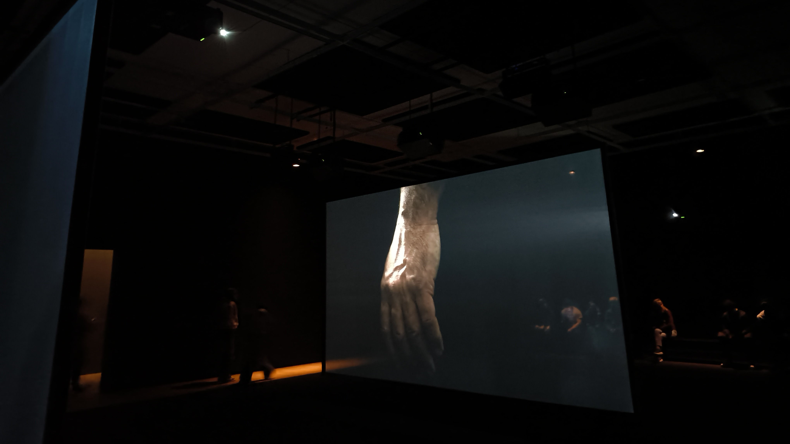
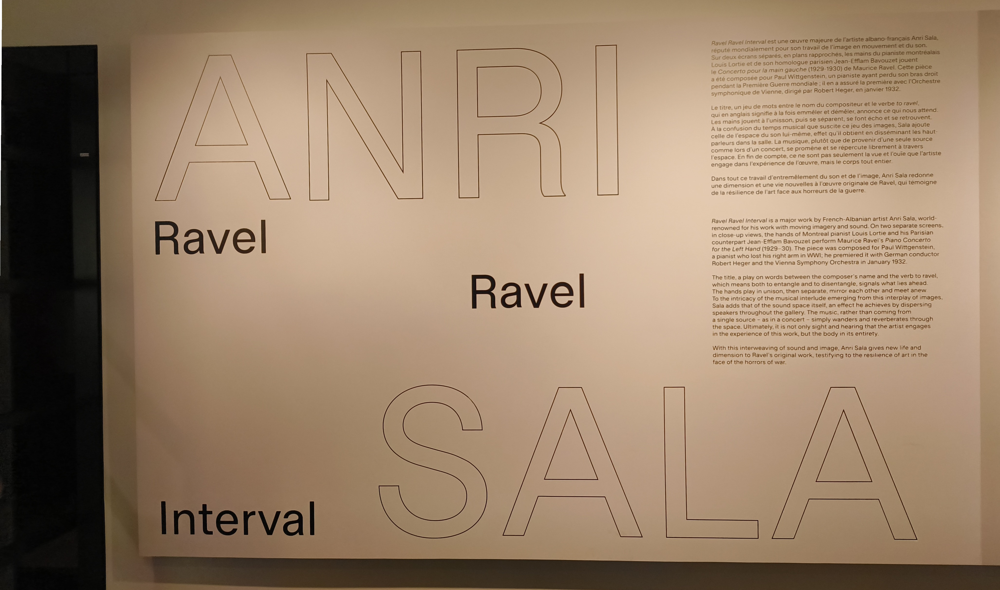

# EXPOSITION MBAM : RAVEL RAVEL INTERVAL

   
  <i>Olivier Laliberté - Ravel Ravel Interval (vue d'ensemble) - 04/04/2025</i>

Le 4 Avril 2025, nous avons eu la chance d'aller au Musée des Beaux-Arts de Montréal pour aller voir l'oeuvre de Anri Sala, apellée Ravel Ravel Interval.   

L'oeuvre est installée dans une salle sombre avec des panneaux absorbant le son tout le long des murs et au plafond. Elle présente une vidéo musicale séparée en trois écrans. La vidéo montre des mains jouant du piano, et pouvait être entendue dans toute la salle. 

## Fiche technique

   
  <i>Olivier Laliberté - Fiche de présentation - 04/04/2025</i>

- Nom de l'exposition : 
- Lieu de mise en exposition : [Musée des Beaux-Arts de Montréal](https://www.mbam.qc.ca/en/)
- Type d'expo : Temporaire intérieure
- Date de visite : 04/04/2025

- Titre de l'oeuvre choisie : Ravel Ravel Interval
- Nom de l'artiste : Anri Sala
- Année de réalisation : 2017

- Description de l'oeuvre :
- Description de l'oeuvre :
- Type d'installation : immersive
- Mise en espace :
- Composantes :
- Éléments nécessaires :
- Expérience vécue :
- Ce qui m'a plu :
