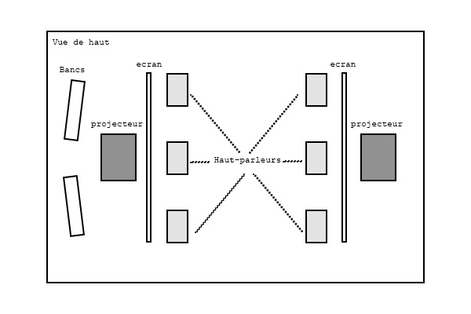
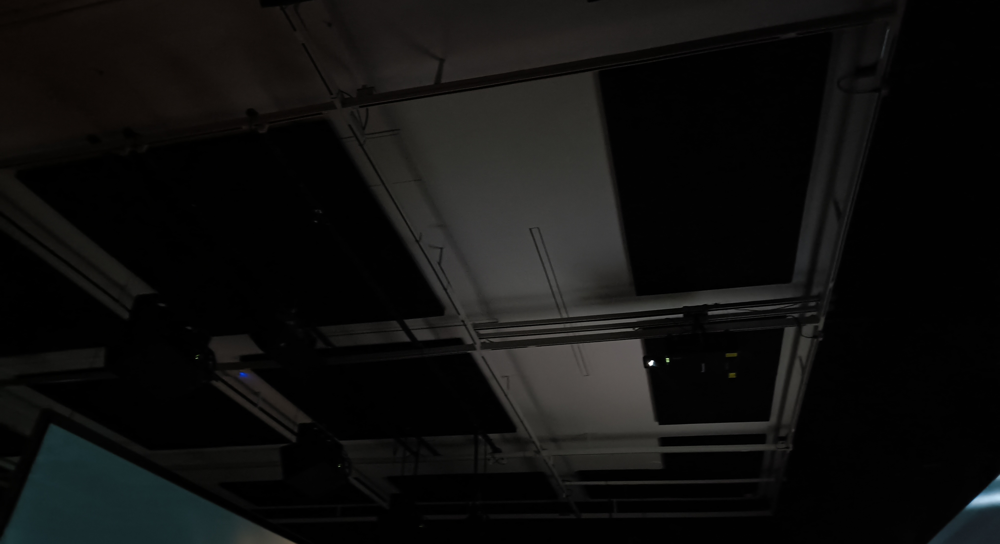
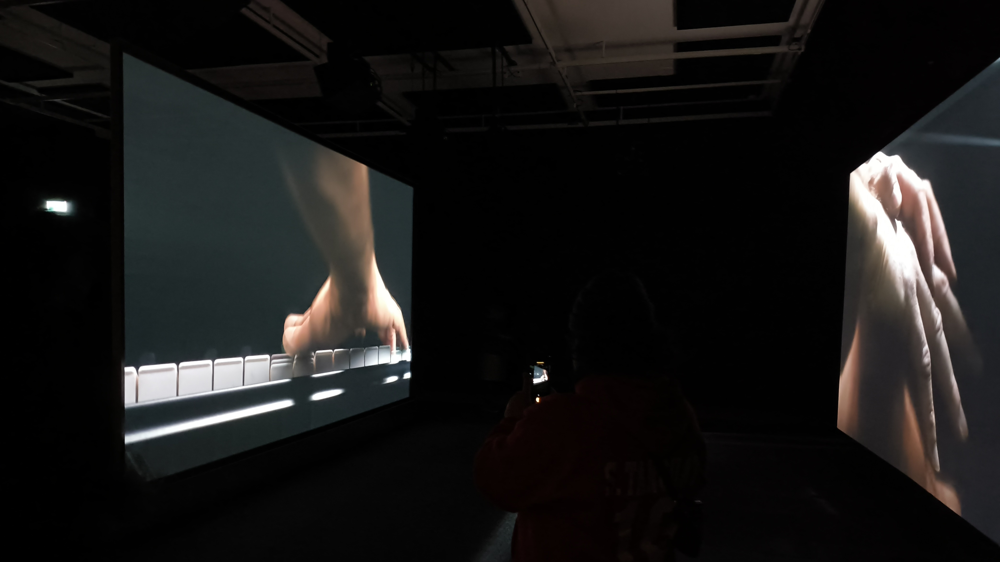

# EXPOSITION MBAM : RAVEL RAVEL INTERVAL

   
  <i>Ravel Ravel Interval (vue d'ensemble) - Olivier Laliberté - 04/04/2025</i>

Le 4 Avril 2025, nous avons eu la chance d'aller au Musée des Beaux-Arts de Montréal pour aller voir l'oeuvre de Anri Sala, apellée Ravel Ravel Interval.   

L'oeuvre est installée dans une salle sombre avec des panneaux absorbant le son tout le long des murs et au plafond. Elle présente une vidéo musicale séparée en deux écrans. La vidéo montre des mains jouant du piano, et pouvait être entendue dans toute la salle.  

L'oeuvre représente deux pianistes interprétant une musique composée par un pianiste ayant perdu l'usage de son bras droit.

## Fiche technique

   
  <i>Fiche de présentation - Olivier Laliberté - 04/04/2025</i>

- Nom de l'exposition : Anri Sala
- Lieu de mise en exposition : [Musée des Beaux-Arts de Montréal](https://www.mbam.qc.ca/en/)
- Type d'expo : Temporaire intérieure
- Date de visite : 04/04/2025

- Titre de l'oeuvre choisie : Ravel Ravel Interval
- Nom de l'artiste : Anri Sala
- Année de réalisation : 2017
- Type d'installation : immersive

### Mise en espace :

   
  <i>Mise en espace - Olivier Laliberté</i>

  
### Composantes :

   
  <i>Ravel Ravel Interval (composantes) - Olivier Laliberté - 04/04/2025</i>

L'oeuvre est composée de deux écrans en son centre, avec des haut-parleurs accrochés au plafond qui font l'ensemble de la salle. Deux projecteurs sont utilisés pour afficher une vidéo sur ces écrans. Des panneaux bloquant le son sont accrochés tout le long des murs et au plafond. Au fond de la salle, deux bancs sont installés.

### Éléments nécessaires :
Fournis par l'artiste :
- Vidéos (pour écran 01 et écran 02)
- Bande sonore  

Fournis par l'intervenant :
- Salle
- Panneaux insonorisants (murs + plafond)
- Écrans (x2)
- Haut-parleurs (x14)
- Bancs (x2)
- Projecteurs (x2)

   
  <i>Ravel Ravel Interval (vue d'ensemble - suite) - Olivier Laliberté - 04/04/2025</i>

### Expérience vécue : 
En entrant dans la pièce, l'ambiance m'a tout de suite choqué. Cette ambiance sombre et tamisée nous permet de focuser principalement sur les deux écrans, qui sont les seuls points illuminés de la salle. On ressent vraiment la puissance du piano, qui est entendu dans toute la pièce. La vidéo jouée durait 20 minutes, mais une fois terminée, on aurait cru qu'une seule minute s'est écoulée. La musique envoutante représente très bien son message, qui, personellement, pourrait dépeindre la souffrance du pianiste compositeur quant à sa perte de sa main. 

### Ce qui m'a plu : 
J'ai particulièrement aimé la bande sonore de l'oeuvre. Au début de la vidéo, la musique est douce et paisible. Par contre, plus la vidéo avance, plus la musique augmente en force et en cadence, en incluant d'autres instruments et en jouant plus fort. Cela me fait penser aux potentielles émotions que les artistes ont vécu lors de la composition du morceau musical, ou lors de son interprétation. On dirait qu'on arrive à ressentir cette colère et tristesse à travers l'oeuvre.

### Ce que j'améliorerais : 
Le fait que la salle n'ait pas beaucoup de bancs pour s'asseoir et écouter l'oeuvre m'a un peu déçu. J'aurais aimé pouvoir voir l'oeuvre dans plusieurs angles différents, puisque les écrans étaient minces et que l'on pouvait voir à travers. Aussi, le fait que je reste debout m'a un peu déconcentré de l'oeuvre. Pour une prochaine fois, je metterais plus de bancs et de places où les écrans se rencontrent, comme des coussins, par exemple.

## Sources

 | 
:-------------------------:|:-------------------------:

*Remerciements + Sources - Olivier Laliberté - 04/04/2025*
